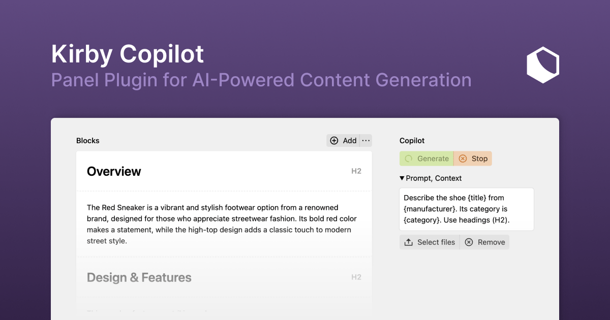

# Kirby Copilot

Kirby Copilot is a plugin for [Kirby CMS](https://getkirby.com) that integrates AI capabilities into your Kirby projects, allowing you to generate content directly from the Panel.

## Features

To streamline content creation for you or your clients and editors, Kirby Copilot offers:

- 🦙 **Multi-model**: Use OpenAI GPT, Anthropic Claude, or Mistral AI models to generate content.
- 🧱 **Blocks support**: Generate content for blocks fields.
- 🌞 **Customizable prompts**: Tailor AI responses with user and system instructions.
- 🎀 **Context-aware responses**: Include context from other fields with placeholders in user prompts to improve content relevance.
- 🛎️ **Playground**: Try out the plugin's features with an interactive live demo.

> [!TIP]
> Kirby Copilot is multi-modal and supports [OpenAI models](https://platform.openai.com/docs/models) such as GPT-4o, [Anthropic Claude](https://www.anthropic.com/claude), and [Mistral models](https://mistral.ai/product/). We will add support for other AI providers if there is enough demand.

---

## Playground

Experience Kirby Copilot firsthand in the [interactive playground](https://kirbycopilot.com/playground).

To play with the plugin section, please enter your [OpenAI API key](https://platform.openai.com/api-keys) in the playground settings field. If you don't have an API key yet, you can register for the [OpenAI API](https://platform.openai.com). The key is required to make client-side requests to the OpenAI API. For production use of the plugin, you will have to store the API key in Kirby's global configuration.

The key will be saved to the **session storage** of your browser. It will not be stored server-side or in any other way.

## Getting Started

To get started, please refer to the [documentation](https://kirbycopilot.com/docs/getting-started) for guidance on installation, configuration, and usage.

Here are some quick links:

- [Installation](https://kirbycopilot.com/docs/getting-started/installation)
- [Global Configuration](https://kirbycopilot.com/docs/configuration/global)
- [Section Configuration](https://kirbycopilot.com/docs/configuration/section)

## Support and Questions

We are committed to support you if you have any questions or issues with Kirby Copilot. There are several ways to get support:

- **GitHub Discussions**: Join the community and engage in discussions on our [GitHub Discussions page](https://github.com/kirby-tools/community/discussions).
- **Email Support**: You can ask questions and seek assistance by emailing us at [hello@kirbycopilot.com](mailto:hello@kirbycopilot.com). Please use the GitHub discussions if you have a general question or comment about Kirby Copilot.
- **GitHub Issues**: For reporting bugs or requesting new features, please use the [GitHub Issues page](https://github.com/kirby-tools/community/issues).

We encourage you to use the resources above to connect with us and other users of Kirby Copilot.

> [!WARNING]
> Please ensure to **never** include any API keys or other sensitive information in bug reports, feature requests, or any other public communication channel.

## Feedback

We value your feedback and ideas for improving Kirby Copilot. If you have any suggestions, please feel free to reach out to us via email or preferably by creating a new discussion on our [GitHub Discussions page](https://github.com/kirby-tools/community/discussions).
